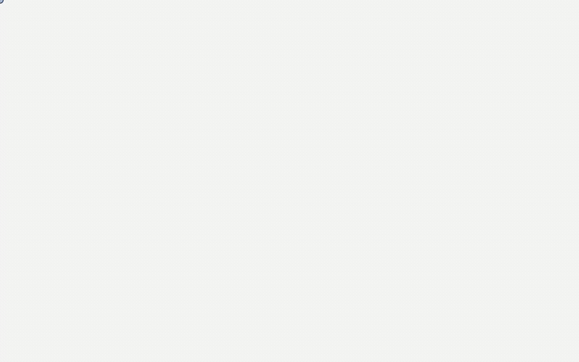

# nocanonetv.it

Reminder to skip the Italian TV licence ("canone RAI") when you qualify for an exemption.

Anyone in an exemption case (no TV, over 75 with low income, foreign diplomats/military) can avoid
the charge on their electricity bill. For non-detention the declaration must be **re-filed every
year**: nocanonetv.it reminds you within the useful window. You always file and sign the
declaration yourself on the official Agenzia delle Entrate site.



## Development

- Backend: FastAPI + Postgres in `server/` (uv, Python 3.12).
- Frontend: React + Vite + TypeScript in `client/`.

```bash
make start          # frontend + backend + db
make migrate        # Alembic migrations
make send_reminders args="--dry-run"
```

## Re-recording the demo

The gif above is generated, not captured by hand, so it can be refreshed
whenever the UI changes:

```bash
make start          # in one terminal
make demo           # in another
```

`demo/record.mjs` is the tape: it drives a real browser through the whole arc
(pick a case, sign up, confirm by email, jump to December, answer the reminder)
and writes `docs/media/nocanonetv-demo.{gif,mp4}` plus a poster frame. The mp4
and the poster are what francescomeli.com embeds.

It runs against the real stack rather than fixtures, because the two links it
follows carry tokens minted by the API and by `send_reminders`: faking them
would film something the product does not do. `demo/demo_db.py` is what keeps
it repeatable, forgetting the demo subscriber before each take and handing the
tape the tokens it would otherwise have to read out of an inbox.

First run downloads a browser (`cd demo && npx playwright install chromium`) and
needs `ffmpeg` and `gifsicle` on PATH.

## Reminder scheduling (cron)

In production the reminders are driven by a `cron` service in `docker-compose.yml`.
It runs the same backend image under [supercronic](https://github.com/aptible/supercronic)
(container-friendly cron, logs to stdout, `TZ=Europe/Rome`) with the schedule in
`crontab`:

- `12,1` — full-year campaign, wording targets the 31 January full-year exemption.
- `5,6` — 2nd-semester fallback, wording targets the 30 June half-year exemption.

`send_reminders` is window-aware and dedups per `(subscriber, year)`, so the daily
runs are idempotent: each subscriber is emailed at most once per reference year and
a failed day simply retries the next. Logs: `docker compose logs cron`.
